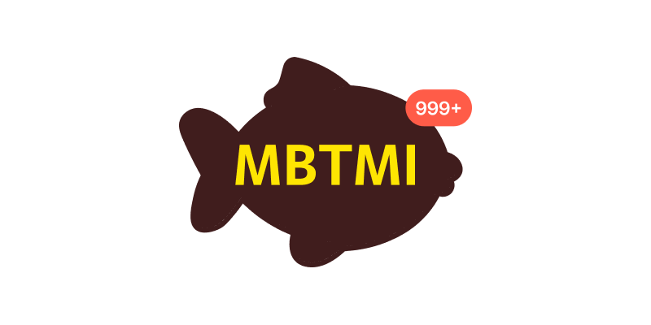

# mbtmi

<div  align="center">
  
</div>

- **배포 링크 :** [mbtmi](https://mbtmi.xyz)
- **블로그 :** [blog](https://mbtmi-sogang.tistory.com/)
- **인스타 그램:** [instagram](https://www.instagram.com/mbtmi_bo.ong/?igshid=MzMyNGUyNmU2YQ%3D%3D)

## 🛫 Intro

- 기존의 O,X 선택지에서 벗어나 정확도가 높은 대화형 mbti app 구현을 목표로 합니다.
- 대부분의 mbti 테스트는 이지 선다로 이루어져 있습니다. 이는 선택의 폭을 좁힐 뿐만 아니라 이미 뻔한 질문에 의해 어떤 결과가 나올지 예측할 수 있습니다. 즉 유저의 선택을 강제하고 다차원적인 분석을 어렵게 만듭니다. 
- 저희의 목표는 주어진 상황에 자유로운 대답을 할 수 있게 해 유저의 다면적인 성격을 캐치하고 성격 분석의 정교함을 높이고자 합니다. 


## 👩‍💻 팀원 소개

| 나경훈 | 방미정 | 허채원 | 손준석 | 박찬호 |
| :--------------: | :--------------: | :--------------: |:--------------: | :--------------: | 
|  |  |  |  |  |
| [@rudgnsdl06](https://github.com/rudgnsdl06) | [@bangmijung](https://github.com/bangmijung) | [@heorshey](https://github.com/heorshey) | [@kd02109](https://github.com/kd02109) | [@chanho12](https://github.com/chanho12) |
| 팁장<br/> - 기획 작업<br/> - BE<br/> - 마케팅<br/> - AWS LightSail<br/> - 모델 작업  | - gpt 프롬프트 작업<br/> - 기획 작업<br/> - 마케팅 작업 - 디자인 작업 | - gpt 프롬프트 작업<br/> - 기획 작업<br/> - 마케팅 작업<br/> - 디자인 작업  | - FE<br/> - 기획 작업<br/> - 디자인 작업<br/> - AWS LightSail<br/>   | - LLM<br/> - 기획 작업<br/>  |

## Tools

### FrontEnd
| Typescript | React | TailwindCss  | esLint | axios | Prettier | Nextjs | 
| :---: | :---: | :---: | :---: | :---: |  :---: |  :---: |
|   | <div style="display: flex; align-items: flex-start;"></div> |  | <div style="display: flex; align-items: flex-start;"></div> | | <div style="display: flex; align-items: flex-start;"></div> |<div style="display: flex; align-items: flex-start;"></div>
 | 
<br>

### Back-end
| python | fastAPI | AWS | postgres |
| :---: | :---: | :---: | :---: | 
| <div style="display: flex; align-items: flex-start;"></div> | <div style="display: flex; align-items: flex-start;"></div> | <div style="display: flex; align-items: flex-start;"></div> | <div style="display: flex; align-items: flex-start;"></div> |  |  |

### model
| python | pytorch | pandas | numpy | 
| :---: | :---: | :---: | :---: | 
| <div style="display: flex; align-items: flex-start;"></div> | <div style="display: flex; align-items: flex-start;"></div> | <div style="display: flex; align-items: flex-start;"></div> | <div style="display: flex; align-items: flex-start;"></div> 


### Tools
| git | github | notion | figma | instagram |
| :---: | :---: | :---: | :---: | :---: |
| <div style="display: flex; align-items: flex-start;"></div> | <div style="display: flex; align-items: flex-start;"></div> | <div style="display: flex; align-items: flex-start;"></div> | <div style="display: flex; align-items: flex-start;"></div> | <div style="display: flex; align-items: flex-start;"></div>

## 로컬에서 기능 테스트 하기

해당 과정을 진행하기 위해서는 node lts v20.9.0 버전 이상과 python 3.10 이상 버전이 설치되어 있어야 합니다.

### FrontEnd
```
cd client
npm i
npm run dev
```

### Server
- 가상환경 디렉터리 생성하기 및 실행

```
## window
cd server
mkdir venvs
cd venvs
python -m venv myapi
cd myapi/Scripts
./activate
```

```
## mac
cd server
mkdir venvs
cd venvs
python3 -m venv myapi
cd myapi/bin
source activate
```

- 필요 패키지 설치

```
## mbtmi/server 경로로 이동
pip install -r requirements.txt
```

- 모델에 필요한 파일 다운로드

모델 관련 파일들은 용량이 크기 때문에, 별도의 다운로드가 필요합니다.
해당 모델은 [KcELECTRA](https://github.com/Beomi/KcELECTRA)를 활용해서 구현했습니다.

server/model 경로에 onnx, classiffer 폴더가 있는 것을 확인할 수 있습니다.
> onnx 설치하기
> - [onnx](https://drive.google.com/drive/folders/1v5ySrWSyKhRYMTI6EE2Lai1JmJmxZCQk) 해당 경로의 파일을 모두 다운로드 하고
> server/model/onnx에 저장합니다.
```
📦onnx
 ┣ 📜.gitkeep
 ┣ 📜IE_model_quantized.onnx
 ┣ 📜JP_model_quantized.onnx
 ┣ 📜NS_model_quantized.onnx
 ┗ 📜TF_model_quantized.onnx
```

</br>
</br>

> classifier 설치하기
> - [classifier](https://drive.google.com/drive/folders/1m58-X7ZHbvlwPXquSU-9vvzlr14_jfZw) 경로의 모든 폴더를 다운로드 합니다.
> - 폴더를 압축해제 한후 해당 폴더를 그대로 classifier에 이동합니다.
```
📦classifier
 ┣ 📂IE2
 ┃ ┣ 📜config.json
 ┃ ┣ 📜model.safetensors
 ┃ ┣ 📜special_tokens_map.json
 ┃ ┣ 📜tokenizer.json
 ┃ ┣ 📜tokenizer_config.json
 ┃ ┗ 📜vocab.txt
 ┣ 📂JP2
 ┃ ┣ 📜config.json
 ┃ ┣ 📜model.safetensors
 ┃ ┣ 📜special_tokens_map.json
 ┃ ┣ 📜tokenizer.json
 ┃ ┣ 📜tokenizer_config.json
 ┃ ┗ 📜vocab.txt
 ┣ 📂NS2
 ┃ ┣ 📜config.json
 ┃ ┣ 📜model.safetensors
 ┃ ┣ 📜special_tokens_map.json
 ┃ ┣ 📜tokenizer.json
 ┃ ┣ 📜tokenizer_config.json
 ┃ ┗ 📜vocab.txt
 ┣ 📂TF2
 ┃ ┣ 📜config.json
 ┃ ┣ 📜model.safetensors
 ┃ ┣ 📜special_tokens_map.json
 ┃ ┣ 📜tokenizer.json
 ┃ ┣ 📜tokenizer_config.json
 ┃ ┗ 📜vocab.txt
```


- 서버 실행

1. server 경로에 .env 파일 생성후 아래와 같이 작성합니다.
```
# auth
SECRET_KEY=4ab2fce7a6bd79e1c014396315ed322dd6edb1c5d975c6b74a2904135172c03c
ACCESS_TOKEN_EXPIRE_MINUTES=1440
secret=please_please_update_me_please
algorithm=HS256

# database
SQLALCHEMY_DATABASE_URL=sqlite:///./myapi.db
```

2. 서버 설정하기 
```
alembic init migrations
```

server/alembic.ini 파일을 열어서 다음과 같이 수정합니다.
```
(... 생략 ...)
sqlalchemy.url = sqlite:///./myapi.db
(... 생략 ...)
```

server/migrations/env.py 를 다음과 같이 수정합니다. 
```py
(... 생략 ...)
import models
(... 생략 ...)
# add your model's MetaData object here
# for 'autogenerate' support
# from myapp import mymodel
# target_metadata = mymodel.Base.metadata
target_metadata = models.Base.metadata
(... 생략 ...)
```

이후 터미널에 다음과 같은 명령어를 입력합니다.
```
alembic revision --autogenerate
alembic upgrade head
```
해당 명령어 이후 myapi.db가 생성 됩니다. 

이후 서버를 실행합니다.
```
uvicorn main:app --reload
```